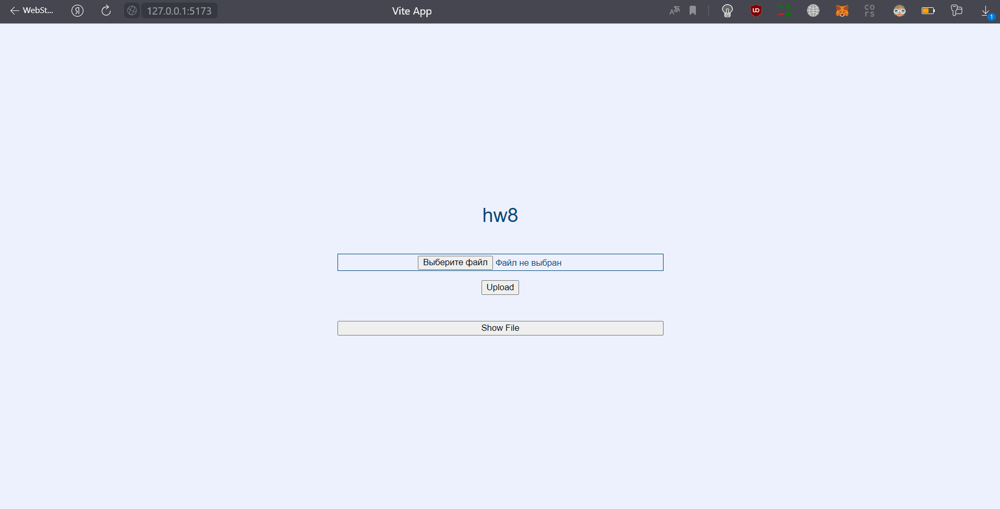
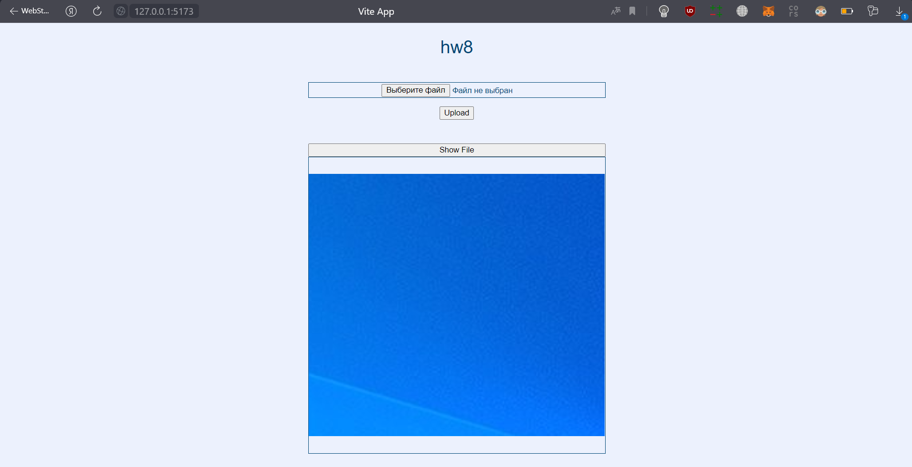

# hw8

## Photos of the project

### Start page


### Example page with photo


## To run tests

```
npx hardhat node
```

### Example tests output

```
> npx hardhat test                                     


  StorageForHashes
    √ Should upload sha256 hash (3841ms)
    √ Should upload sha512 hash (95ms)
    √ Should upload sha512 hash with address (64ms)


  3 passing (4s)
```

# How to run system

To run local node:
```
npx hardhat node
```

To deploy contract to local node:
```
npx hardhat run --network localhost scripts/deploy.js
```

To run frontend:
```
cd .\frontend\
npm install
npm run dev
```

Eventually, you can go to the website

There is a file upload button, after selecting a file, click the `Upload` button and, in the end, 
you can find the photo below by clicking the `Show File` button

----
### Some settings for IPFS if CORS is not enabled

```
{
  "API": {
    "HTTPHeaders": {
      "Access-Control-Allow-Credentials": [
        "true"
      ],
      "Access-Control-Allow-Headers": [
        "Authorization"
      ],
      "Access-Control-Allow-Methods": [
        "GET",
        "POST"
      ],
      "Access-Control-Allow-Origin": [
        "*"
      ],
      "Access-Control-Expose-Headers": [
        "Location"
      ]
    }
  },
  ...
}
```

### Some configurations: (will change soon)

If after deploying the contract, its address differs from `0xe7f1725E7734CE288F8367e1Bb143E90bb3F0512`, 
then change it in the file [App.vue](./frontend/src/App.vue) 

Also, if the connection port to ipfs is not `5001`, 
you can also change it in the file [App.vue](./frontend/src/App.vue) 